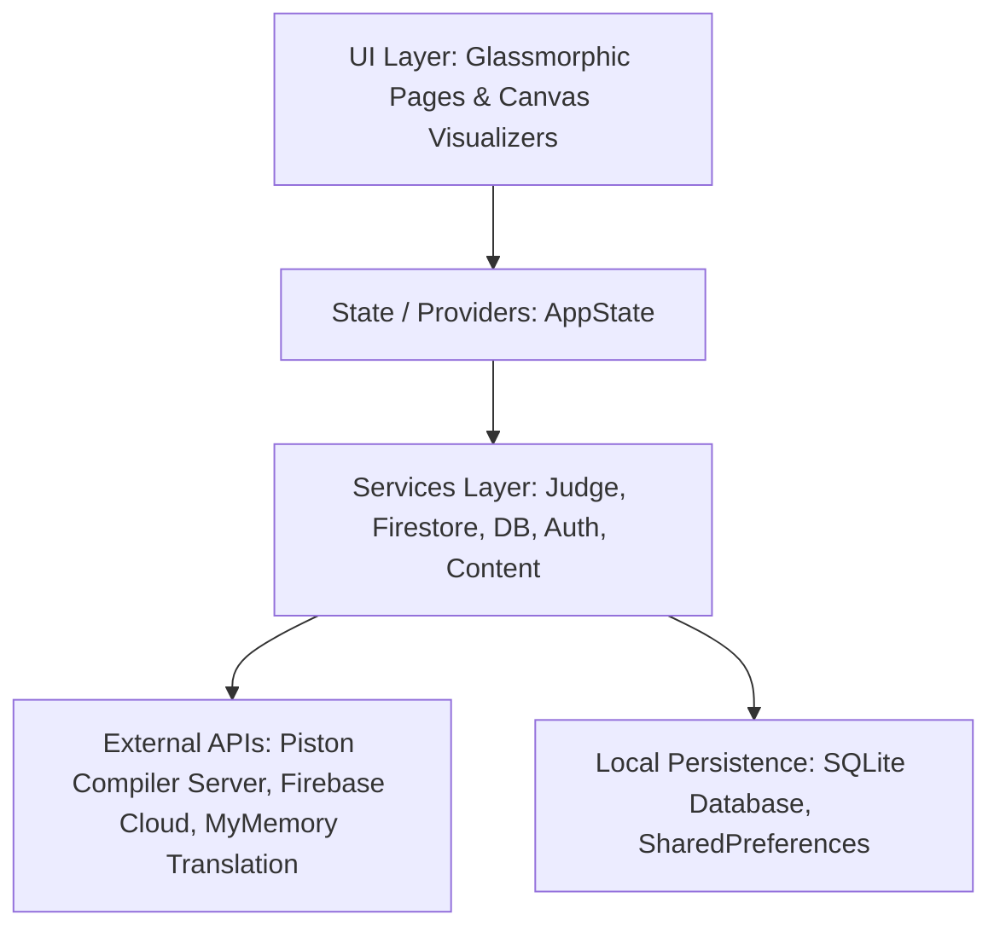
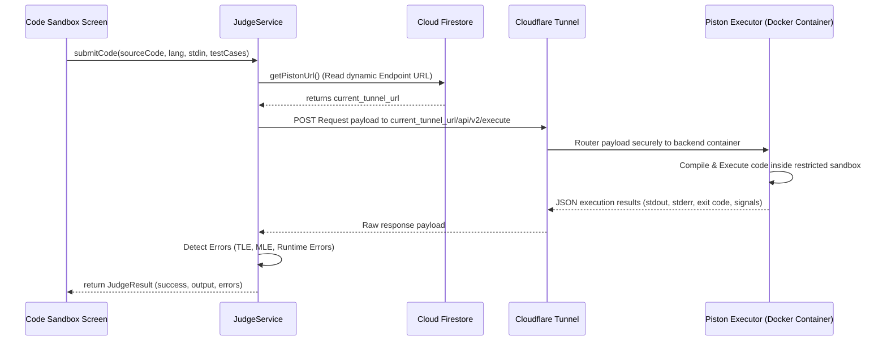

# BitStride Core — Developer Wiki

Welcome to the **BitStride Core** Developer Wiki. This document serves as a deep-dive technical reference for the learner-facing mobile/desktop application. It details the architecture, design choices, state management, database services, and runtime execution judges that power the application.

---

## 1. System Architecture & Directory Layout

BitStride Core is built on a clean, decoupled layer system following the MVVM-inspired architecture patterns in Flutter:



### Key Subsystems:
* **UI Pages & Custom Canvas Widgets** (`lib/screens/`, `lib/widgets/`): High-fidelity, premium glassmorphism layouts, custom mascot animation states, and dynamic sorting visualizer rendering using Flutter's `CustomPainter`.
* **State Providers** (`lib/providers/`): Manages user authentication sessions, dynamic curriculum loading, sorting state streams, and application configuration overrides.
* **Services** (`lib/services/`): Decoupled business logic modules communicating with Firestore, the remote code judge, translation endpoints, and local SQLite data.
* **Data Models** (`lib/models/`): Structured schemas representing courses, challenges, exercises, user profiles, achievements, and compiler execution states.

---

## 2. Global State Management & Navigation Flow

The central nervous system of the application's state is **AppState** ([app_state.dart](file:///C:/Users/Mihai/Desktop/Bitsride%20Temp/BitStride_Core/lib/providers/app/app_state.dart)), a global state notifier registered via the `Provider` framework in [main.dart](file:///C:/Users/Mihai/Desktop/Bitsride%20Temp/BitStride_Core/lib/main.dart).

```
[User Action] ---> [AppState Method] ---> [Local SQLite / Firebase Sync] ---> [notifyListeners()] ---> [UI Rebuilds]
```

### Profile Progression System:
User progression is calculated dynamically on the client inside the `UserProgress` model based on cumulative Experience Points (XP) earned:
* **Initial Level Target**: 100 XP.
* **Scaling Modifier**: Each subsequent level increases the required XP threshold by 50% (`XP_for_Next_Level = Current_Level_XP_Requirement * 1.5`).
* **Active Streak Counter**: Calculated on startup by evaluating the difference between `lastActiveDate` and the current timestamp:
  - Difference == 1 day: Streak incremented by 1.
  - Difference > 1 day: Streak resets to 1 (new streak).
  - Difference == 0 days (same day activity): Streak maintained.

---

## 3. Database Services & Scribing Synchronization

BitStride Core employs a dual-database design strategy (Offline-First cache with Remote Cloud Sync):

### A. Local Cache Service (`DatabaseService`)
* Uses **SQLite** via `sqflite` (or `sqflite_common_ffi` on desktop targets) to store local copies of courses, lessons, and practice history.
* **Schema**:
  - `progress`: Tracks user statistics (`xp`, `streak`, `completed_lessons`, `completed_challenges`, `unlocked_badges`).
  - `lessons_cache`: Stores JSON representation of course curricula for immediate offline access.

### B. Remote Cloud Sync (`FirestoreService`)
* Sychronizes user states asynchronously to Cloud Firestore when internet connectivity is active.
* **Collections Layout**:
  - `users/{uid}`: Stored document tracking global profile details (`display_name`, `email`, `xp`, `streak`, `last_active`).
  - `users/{uid}/meta/settings`: Key-value properties representing visual theme, localization configurations, and layout optimizations.
  - `courses/{courseId}`: Course curricula structures generated from BitStride Studio.
  - `courses/{courseId}/translations/{lang}`: Dynamic translations for syllabus markdown segments.
  - `challenges/{challengeId}`: Global programming sandbox tasks.

---

## 4. Remote Compiler Sandbox & Execution Judge

### Compilation Flow Architecture



### Technical Integration Details:
1. **Dynamic URL Binding**: The `JudgeService` fetches the Piston endpoint URL dynamically from Firestore (`config/piston` -> `piston_base_url`).
2. **Cloudflare Tunnel Routing**: The Piston compilation endpoint is routed via a secure `cloudflared` tunnel. This architecture protects the local backend infrastructure from direct exposure to the public internet, eliminating open ports, handling SSL termination, and mitigating DDoS attacks.
3. **Execution Sandboxing Limits**:
   - Time Limit: Defaults to 10,000ms.
   - Memory Limits: Automatically injected into C++ (`setrlimit(RLIMIT_AS, ...)`) and Python (`resource.setrlimit(...)`) processes using dynamic code-injection templates during judge preprocessing.
4. **Signals & Error Parsing**:
   - `SIGSEGV` or Exit Code `139`: Segmentation Fault (invalid memory pointers).
   - `SIGFPE` or Exit Code `136`: Division by Zero (floating point exception).
   - `SIGKILL` / `SIGXCPU`: Time Limit Exceeded (process terminated by kernel scheduler).
   - `bad_alloc` / `MemoryError`: Memory Limit Exceeded.

---

## 5. Algorithmic Sorting Visualizer Engine

The Sorting Visualizer is designed as a pure reactive stream engine (`SortAlgorithms` in `sort_algorithms.dart`).

* **Supported Algorithms**:
  - *Comparison-based (Elementary)*: Bubble Sort, Selection Sort, Insertion Sort.
  - *Efficient Sorts*: Quick Sort, Merge Sort, Heap Sort, Cycle Sort, 3-way Merge Sort.
  - *Distribution Sorts*: Counting Sort, Radix Sort, Bucket Sort, Pigeonhole Sort.
  - *Hybrid Sorts (Production Grade)*: Introsort (Quick Sort falling back to Heap Sort to avoid $O(N^2)$ worst cases), Timsort (hybrid Merge/Insertion sort finding natural runs).

* **Reactivity Model**:
  Algorithms do not modify arrays in a single blocking thread. Instead, they run asynchronously and yield `SortEvent` items into a Dart `Stream` containing:
  - The current state of the array.
  - A `Set<int>` of indices currently being compared (rendered in highlighting color).
  - A `Set<int>` of indices being swapped/written (rendered in warning color).
  - A `Set<int>` of indexes marked as sorted (rendered in brand green).
  - The current comparison, array access, and swap counters.
  - The active line number of the pseudo-code being visualized.
* **Canvas Rendering**: Renders the vertical bars utilizing a custom `CustomPainter` optimized to draw only updated states, keeping visual transitions smooth at 60fps.

---

## 6. Onboarding & Project Configurations

### Prerequisites
* Flutter SDK (Target Version: `^3.22.x` or newer)
* Dart SDK (Target Version: `^3.5.4` or newer)
* Local Gitea/GitHub environment

### Local Setup & Compilation Guide
1. **Initialize Dependencies**:
   ```bash
   flutter pub get
   ```
2. **Compile Translations**:
   BitStride Core uses arb files located in `lib/l10n/` for static string localization. Generate the localization code using:
   ```bash
   flutter gen-l10n
   ```
3. **Add Firebase Credentials**:
   > [!IMPORTANT]
   > The repository contains no credentials. You must create a new Firebase Project and copy:
   > - Android: `android/app/google-services.json`
   > - Web: Initialize options in `lib/firebase_options.dart` (generated by the `flutterfire configure` command line tool).
   Without these files, compilation will fail with build/linking exceptions.

4. **Run Application**:
   - For Mobile Debugging (Android / Emulator):
     ```bash
     flutter run -d <device_id>
     ```
   - For Web Testing (hosted locally):
     ```bash
     flutter run -d chrome
     ```
