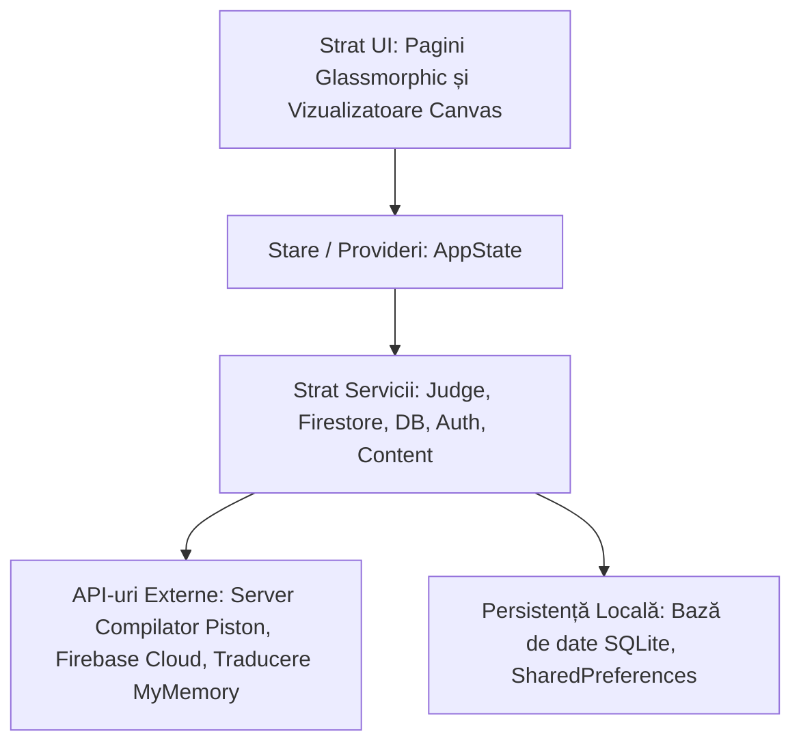
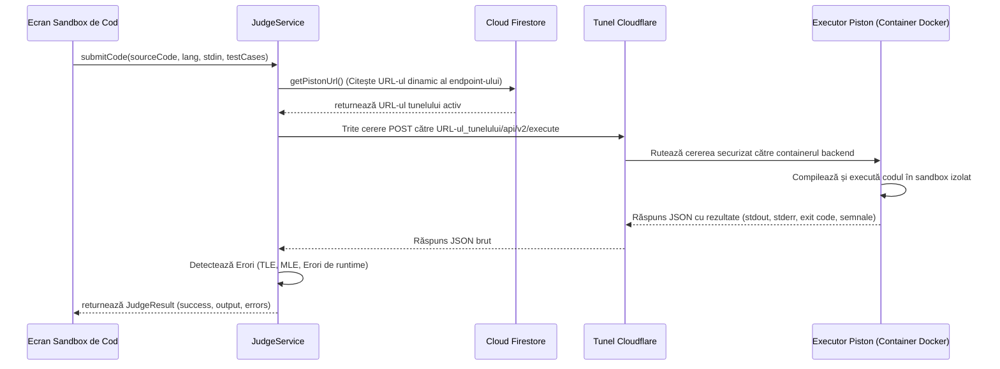

# BitStride Core — Wiki pentru Dezvoltatori

Bun venit la Wiki-ul pentru dezvoltatori al **BitStride Core**. Acest document servește ca referință tehnică detaliată pentru aplicația mobilă/desktop destinată elevilor. Sunt prezentate arhitectura, deciziile de design, managementul stării, serviciile de bază de date și evaluatorul de rulare a codului.

---

## 1. Arhitectura Sistemului și Structura Directoarelor

BitStride Core este construit pe un sistem curat, decuplat pe straturi, urmând modelul de arhitectură MVVM adaptat pentru Flutter:



### Subsisteme Cheie:
* **Pagini UI și Widget-uri Canvas Personalizate** (`lib/screens/`, `lib/widgets/`): Interfețe grafice de înaltă fidelitate cu efecte de tip glassmorphism, controlere de animație pentru mascotă și redarea vizualizatorului grafic al algoritmilor de sortare folosind `CustomPainter` din Flutter.
* **Provideri de Stare** (`lib/providers/`): Gestionează sesiunile de autentificare a utilizatorilor, încărcarea dinamică a programei de învățare, fluxurile de date pentru starea de sortare și suprascrierea configurațiilor de sistem.
* **Servicii** (`lib/services/`): Module de logică de business decuplate care comunică cu Firestore, evaluatorul extern de cod, endpoint-urile de traducere și baza de date locală SQLite.
* **Modele de Date** (`lib/models/`): Scheme structurate care reprezintă cursuri, provocări, exerciții, profiluri de utilizatori, realizări și rezultatele execuției compilatorului.

---

## 2. Managementul Global al Stării și Fluxul de Navigare

Nucleul stării aplicației este **AppState** ([app_state.dart](file:///C:/Users/Mihai/Desktop/Bitsride%20Temp/BitStride_Core/lib/providers/app/app_state.dart)), un generator de notificări la nivel global înregistrat prin framework-ul `Provider` în [main.dart](file:///C:/Users/Mihai/Desktop/Bitsride%20Temp/BitStride_Core/lib/main.dart).

```
[Acțiune Utilizator] ---> [Metodă AppState] ---> [Sincronizare SQLite local / Firebase] ---> [notifyListeners()] ---> [Reconstrucție interfață UI]
```

### Sistemul de Progresie al Profilului:
Progresul elevului este calculat dinamic pe client în modelul `UserProgress` pe baza Punctelor de Experiență (XP) acumulate:
* **Obiectiv Nivel Inițial**: 100 XP.
* **Modificator de Scalare**: Fiecare nivel ulterior crește pragul de XP necesar cu 50% (`XP_pentru_Nivelul_Următor = Cerință_XP_Nivel_Curent * 1.5`).
* **Contor Streak Activ**: Calculat la pornirea aplicației prin evaluarea diferenței dintre `lastActiveDate` și data curentă:
  - Diferența == 1 zi: Streak-ul crește cu 1.
  - Diferența > 1 zi: Streak-ul se resetează la 1 (streak nou).
  - Diferența == 0 zile (activitate în aceeași zi): Streak-ul este menținut.

---

## 3. Servicii de Bază de Date și Sincronizarea Datelor

BitStride Core folosește o strategie de bază de date duală (Cache offline-first cu sincronizare asincronă în cloud):

### A. Serviciul de Cache Local (`DatabaseService`)
* Utilizează **SQLite** prin intermediul `sqflite` (sau `sqflite_common_ffi` pe versiunile de desktop) pentru a stoca copii locale ale cursurilor, lecțiilor și istoricului exercițiilor.
* **Schemă**:
  - `progress`: Stochează datele statistice ale utilizatorului (`xp`, `streak`, `completed_lessons`, `completed_challenges`, `unlocked_badges`).
  - `lessons_cache`: Stochează formatul JSON al cursurilor pentru acces offline instantaneu.

### B. Sincronizarea Remote Cloud (`FirestoreService`)
* Sincronizează datele utilizatorului în mod asincron în Cloud Firestore când conexiunea la internet este activă.
* **Structura Colecțiilor**:
  - `users/{uid}`: Document de profil global (`display_name`, `email`, `xp`, `streak`, `last_active`).
  - `users/{uid}/meta/settings`: Proprietăți de tip cheie-valoare pentru temă, localizare și optimizări vizuale.
  - `courses/{courseId}`: Structurile cursurilor create în BitStride Studio.
  - `courses/{courseId}/translations/{lang}`: Traduceri dinamice pentru conținutul markdown al lecțiilor.
  - `challenges/{challengeId}`: Provocări globale de programare pentru modul Sandbox.

---

## 4. Compilatorul Securizat și Evaluatorul de Cod (Judge)

### Arhitectura Fluxului de Compilare



### Detalii de Integrare Tehnică:
1. **Preluarea Dinamică a URL-ului**: `JudgeService` preia URL-ul evaluatorului Piston dinamic din Firestore (`config/piston` -> `piston_base_url`).
2. **Rutarea prin Cloudflare Tunnel**: Endpoint-ul de compilare Piston este expus prin intermediul unui tunel securizat `cloudflared`. Această arhitectură protejează infrastructura locală de compilare împotriva accesului direct de pe internet, eliminând necesitatea deschiderii de porturi în router, gestionând certificatele SSL și reducând riscurile asociate atacurilor DDoS.
3. **Limite de Execuție în Sandbox**:
   - Limitare de Timp: Implicit 10.000 ms (10 secunde).
   - Limitare de Memorie: Injectată automat la nivel de sistem în procesele C++ (`setrlimit(RLIMIT_AS, ...)`) și Python (`resource.setrlimit(...)`) prin șabloane de cod dynamically injectate în timpul preprocesării înainte de compilare.
4. **Interpretarea Semnalelor și Erorilor**:
   - `SIGSEGV` sau Exit Code `139`: Erori de segmentare (indicatori/pointeri invalizi de memorie).
   - `SIGFPE` sau Exit Code `136`: Împărțire la zero.
   - `SIGKILL` / `SIGXCPU`: Depășirea limitei de timp (Time Limit Exceeded - proces oprit forțat de kernel).
   - `bad_alloc` / `MemoryError`: Depășirea limitei de memorie (Memory Limit Exceeded).

---

## 5. Motorul Grafic al Vizualizatorului de Algoritmi de Sortare

Vizualizatorul este proiectat ca un motor bazat pe fluxuri de date reactive (`SortAlgorithms` în `sort_algorithms.dart`).

* **Algoritmi Suportați**:
  - *Sortări prin comparare (Elementare)*: Bubble Sort, Selection Sort, Insertion Sort.
  - *Sortări Eficiente*: Quick Sort, Merge Sort, Heap Sort, Cycle Sort, 3-way Merge Sort.
  - *Sortări prin Distribuție*: Counting Sort, Radix Sort, Bucket Sort, Pigeonhole Sort.
  - *Sortări Hibride (Producție)*: Introsort (Quick Sort cu fallback în Heap Sort pentru a asigura complexitate $O(N \log N)$), Timsort (sortare hibridă bazată pe Merge/Insertion sort optimizată pentru șiruri parțial sortate).

* **Modelul de Reactivitate**:
  Algoritmii nu blochează interfața grafică pe parcursul rulării. Aceștia rulează asincron și trimit obiecte `SortEvent` într-un flux Dart `Stream` ce conține:
  - Starea curentă a elementelor din vector.
  - Indexii elementelor comparate în acel moment (colorați diferențiat).
  - Indexii elementelor interschimbate/scrise (colorați cu avertizare).
  - Indexii elementelor confirmate ca fiind sortate (colorați în verde).
  - Contorul curent de comparări, accesări de memorie și interschimbări.
  - Linia curentă de cod din pseudo-codul corespunzător algoritmului.
* **Randare Optimizată**: Desenarea barelor este realizată prin intermediul clasei `CustomPainter` optimizată pentru a redesena doar elementele modificate, asigurând fluiditate la 60 de cadre pe secundă (fps).

---

## 6. Ghid de Configurare și Compilare

### Cerințe Preliminare
* Flutter SDK (Versiune Minimă: `^3.22.x`)
* Dart SDK (Versiune Minimă: `^3.5.4`)
* Mediu local Git/Gitea

### Configurare și Rulare Pas cu Pas
1. **Instalarea Dependințelor**:
   ```bash
   flutter pub get
   ```
2. **Generarea Fișierelor de Traducere**:
   Aplicația folosește formatul de localizare standard Flutter. Generați fișierele cu următoarea comandă:
   ```bash
   flutter gen-l10n
   ```
3. **Adăugarea Credențialelor Firebase**:
   > [!IMPORTANT]
   > Codul din depozit a fost curățat de cheile de acces. Trebuie să creați propriul proiect Firebase și să copiați:
   > - Android: `android/app/google-services.json`
   > - Web: Generați și configurați parametrii în `lib/firebase_options.dart`.
   > În absența acestora, compilarea va eșua cu erori de configurare.

4. **Rularea Aplicației**:
   - Rulare pe Dispozitiv Mobil (Android / Emulator):
     ```bash
     flutter run -d <id_dispozitiv>
     ```
   - Rulare în Browser (Web):
     ```bash
     flutter run -d chrome
     ```
